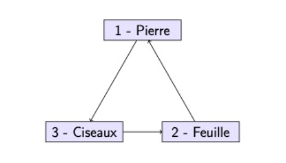

# Analyse statistique et conception d'interfaces homme-machine

## Problématique

Pierre-feuille-ciseaux est un jeu opposant deux joueurs. À chaque tour, les joueurs annoncent simultanément le coup qu'ils ont choisi parmi les trois possibilités "Pierre", "Feuille" ou "Ciseaux". Les coups
gagnants sont représentés dans la figure ci-dessous. Si les deux joueurs choisissent le même coup, la manche est
nulle.

Une stratégie efficace pour ne pas perdre à ce jeu consiste à choisir ses coups de manière indépendante,
et uniformément dans l'ensemble {Pierre, Feuille, Ciseaux}. Cependant, les humains éprouvent d'énormes
difficultés à produire un véritable hasard : ils sont influencés par diverses considérations psychologiques.
Un ordinateur peut ainsi battre un humain, s'il arrive à anticiper les actions de son adversaire. Pour cela,
il connaît l'historique (l'échantillon) des coups réalisés par son adversaire. À partir de cet échantillon,
l'ordinateur peut inférer la loi de génération des coups de son adversaire humain. Il s'agit donc d'un
problème d'estimation. L'objectif de ce projet est de construire une intelligence artificielle basée sur ces
principes.

## Présentation

Ce projet se compose de deux analyses centrées sur l'application des statistiques :

* **Modélisation d'un jeu Pierre-Feuille-Ciseaux** : Utilisation des chaînes de Markov pour représenter les décisions d'un joueur humain et implémentation d'une intelligence artificielle capable d'optimiser sa prise de décision.

* **Tests statistiques** : Évaluation de la conformité d'un échantillon à une distribution normale et tests d'indépendance entre variables.

## Contenu

### Étude 1 : Modélisation du jeu Pierre-Feuille-Ciseaux

* **Estimation des paramètres** : Élaboration d'une matrice de transition basée sur les choix passés du joueur.

* **Stratégie prédictive** : Prédiction des coups adverses pour maximiser les gains.

* **Développement logiciel** : Conception d'une interface interactive pour affronter l'IA.

* **Analyse des choix** : Application de tests statistiques pour déterminer si les choix du joueur suivent une distribution aléatoire.

### Étude 2 : Vérifications statistiques

* **Test de normalité** : Comparaison d'un échantillon à une loi normale via un test du χ².

* **Étude de l'asymétrie** : Étude de la distribution et test d'adéquation à une loi normale asymétrique.

* **Test d'indépendance** : Vérification de l'indépendance entre deux caractéristiques.
